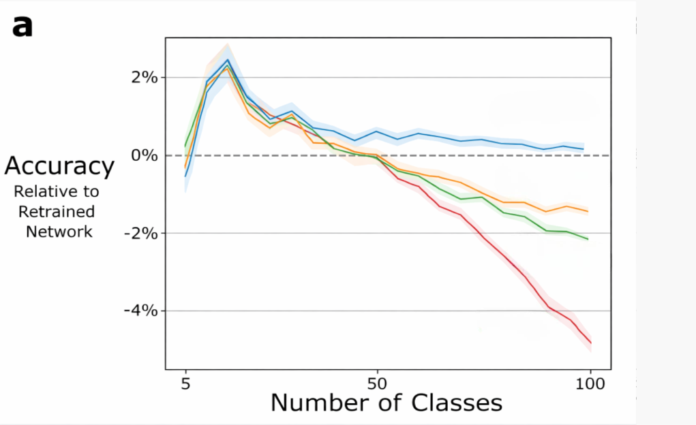
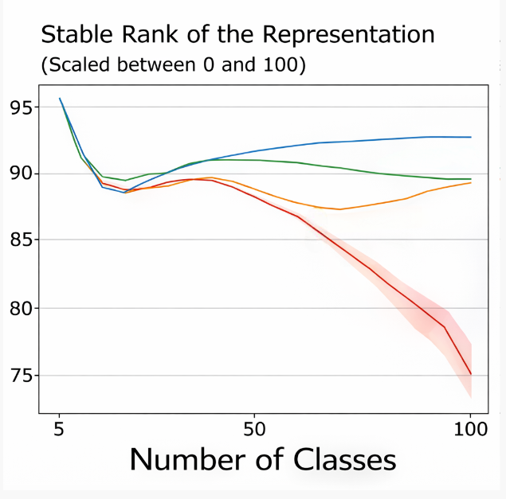
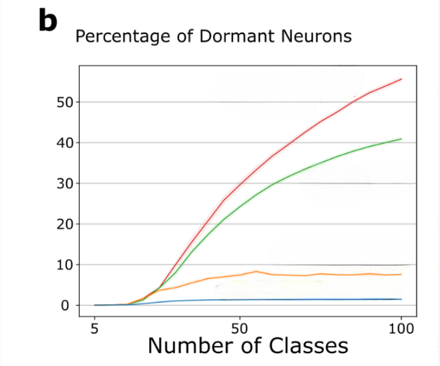

# Permuted-CIFAR-and-MNIST-dataset-with-Contunal-BackProp
PyTorch implementation of Continual Backpropagation experiments for studying plasticity, feature replacement, dormant neurons, representation rank, and invariance in non-stationary learning tasks such as Permuted MNIST, CIFAR-100, and slowly changing regression.


# CBP + CReLU Invariance Experiments

This repository extends Continual Backpropagation experiments with support for **CReLU activations** and **invariance analysis**. The goal of these experiments is to study whether Continual Backpropagation can help neural networks maintain useful, diverse, and transformation-stable features in non-stationary learning settings.

The implementation focuses on two experiment families:

1. **Permuted MNIST with CBP, CReLU, and invariance tracking**
2. **Incremental CIFAR-100 with ResNet, CBP/GnT, CReLU, and invariance tracking**

The code builds on Continual Backpropagation / Generate-and-Test ideas and adds explicit measurement of feature invariance under label-preserving input transformations.

## Accreditation

This project is based on and adapted from the original **loss-of-plasticity** codebase:

https://github.com/shibhansh/loss-of-plasticity

Credit goes to the original authors of that repository for the Continual Backpropagation framework, Generate-and-Test feature replacement implementation, and the base experimental infrastructure. This version adds or modifies experiment code for CReLU support and invariance measurement.

## What is being tested?

The experiments study three related ideas:

### 1. Continual Backpropagation

Continual Backpropagation keeps a neural network plastic by periodically replacing low-utility hidden units. During learning, the algorithm tracks feature utility, identifies mature units with low utility, reinitializes their incoming weights, and clears their outgoing contribution so they can relearn useful representations.

### 2. CReLU activations

CReLU stands for **Concatenated ReLU**. For an input activation vector `x`, CReLU returns:

```python
torch.cat([torch.relu(x), torch.relu(-x)], dim=1)
```

This preserves both positive and negative evidence by splitting each underlying feature into two nonnegative channels:

* `ReLU(x)`
* `ReLU(-x)`

In the feed-forward MNIST experiment, when `activation == "crelu"`, the linear layer creates half as many base features, then CReLU doubles the representation back to the requested hidden width.

For example, if `num_features = 2000`, the CReLU layer internally creates `1000` linear features and outputs `2000` activated features.

### 3. Invariance measurement

The invariance code measures whether hidden units keep firing when an input is changed in a label-preserving way.

For each evaluation batch:

1. Compute activations on the original input.
2. Apply a random semantic transform to each input.
3. Compute activations on the transformed input.
4. Determine which units are “firing” using a high-percentile threshold.
5. Compare firing patterns between original and transformed inputs.

The score is computed per unit and then averaged per layer.

The core score is:

```text
score = P(unit fires on transformed input | unit fired on original input)
        ---------------------------------------------------------------
        P(unit fires on transformed input)
```

A higher score means that a unit is more likely to preserve its response under semantic transformations.

## Permuted MNIST CBP + CReLU + Invariance

The Permuted MNIST experiment is implemented in:

```text
online_expr.py
invariance.py
load_mnist.py
```

### Data setup

MNIST is loaded using `load_mnist.py`. The images are flattened from `28 x 28` into vectors of length `784` and saved to:

```text
data/mnist_
```

The experiment then reads the saved dataset during training.

### Task structure

The Permuted MNIST experiment creates a sequence of tasks by randomly permuting the input pixels. At the start of each task:

```python
pixel_permutation = np.random.permutation(input_size)
x = x[:, pixel_permutation]
```

This means each task contains the same digit labels, but the pixel layout changes. The model must continue learning under changing input distributions.

Default task settings include:

```python
classes_per_task = 10
images_per_class = 6000
input_size = 784
change_after = 10 * 6000
```

The number of tasks can be set directly with `num_tasks`, or inferred from:

```python
num_tasks = int(num_examples / change_after)
```

### Model architecture

The main model is `DeepFFNNCustom`.

It supports:

```text
relu
tanh
crelu
```

For CReLU, the implementation uses:

```python
class CReLU(nn.Module):
    def forward(self, x):
        return torch.cat([torch.relu(x), torch.relu(-x)], dim=1)
```

The hidden layer construction is:

```python
if activation == "crelu":
    base_features = num_features // 2
    linear = nn.Linear(in_dim, base_features)
    act = CReLU()
    out_dim = base_features * 2
```

This keeps the final hidden representation size equal to `num_features`, while allowing CReLU to represent both positive and negative activation directions.

The model’s `predict` method returns both logits and hidden representations:

```python
logits, reps = net.predict(x)
```

The hidden representations are used by both CBP and the invariance analysis.

### Learners

The experiment supports several agent types:

```text
linear
bp
l2
cbp
```

For normal backpropagation-style baselines, the code uses:

```python
Backprop(...)
```

For Continual Backpropagation, the code uses:

```python
ContinualBackprop(...)
```

with parameters such as:

```python
replacement_rate
maturity_threshold
decay_rate
util_type
```

The CBP learner performs a gradient update and then runs generate-and-test feature replacement.

### Invariance evaluation

Invariance is measured every `rank_measure_period` examples:

```python
rank_measure_period = 60000
```

At each measurement point, the experiment evaluates the first `2000` examples:

```python
eval_x = x[:2000]
```

Then it computes invariance using:

```python
layer_scores, _ = compute_invariance_scores(
    net=net,
    x_eval=eval_x,
    use_abs=use_abs,
    firing_rate=0.01
)
```

For CReLU, the code sets:

```python
use_abs = (activation == "crelu")
```

This is important because CReLU represents positive and negative evidence separately. Using absolute activation magnitude makes the invariance calculation treat both directions as meaningful activity.

### MNIST semantic transforms

The MNIST invariance code reshapes flattened vectors back into image format:

```python
x2 = x.view(-1, 1, 28, 28)
```

Then it randomly applies one transform per image:

```text
shift_x
shift_y
rot
identity
```

The transformed image is flattened back to `[N, 784]` before being passed through the network.

### MNIST invariance threshold

For each hidden unit, a firing threshold is computed using a quantile:

```python
q = 1.0 - firing_rate
tau = torch.quantile(a, q=q, dim=0)
```

With the default:

```python
firing_rate = 0.01
```

each unit is treated as firing only on approximately its top 1% strongest activations.

### Logged MNIST metrics

The Permuted MNIST experiment stores:

```text
accuracies
weight_mag_sum
ranks
invariance_scores
effective_ranks
approximate_ranks
abs_approximate_ranks
dead_neurons
```

These metrics allow comparison between standard backpropagation and CBP under CReLU.

## Incremental CIFAR-100 CBP + CReLU + Invariance

The CIFAR experiment is implemented in:

```text
incremental_cifar_experiment.py
invarianceCIFAR.py
run_cifar.py
post_run_analysis.py
res_gnt.py
```

### Dataset

The experiment uses CIFAR-100 with normalized image tensors. The data loader uses:

```python
CifarDataSet(
    cifar_type=100,
    image_normalization="max",
    label_preprocessing="one-hot",
    use_torch=True
)
```

The normalization constants are:

```python
mean = (0.5071, 0.4865, 0.4409)
std = (0.2673, 0.2564, 0.2762)
```

For training, the experiment applies data augmentation:

```text
RandomHorizontalFlip
RandomCrop
RandomRotator
```

### Incremental class learning

The CIFAR experiment does not train on all 100 classes at once. It starts with a small number of classes and gradually adds more.

Default settings include:

```python
num_classes = 100
initial_num_classes = 5
class_increment = 5
class_increase_frequency = 200
num_epochs = 4000
```

The class order is randomized:

```python
self.all_classes = np.random.permutation(self.num_classes)
```

At the start, only the first `initial_num_classes` are active. After every `class_increase_frequency` epochs, the experiment expands the active class set:

```python
self.current_num_classes = min(
    self.current_num_classes + self.class_increment,
    self.num_classes
)
```

The train, validation, and test datasets are then repartitioned to include the new active classes.

### CIFAR model

The CIFAR model is a modified ResNet-18:

```python
self.net = build_resnet18(
    num_classes=self.num_classes,
    norm_layer=torch.nn.BatchNorm2d,
    activation=self.activation,
)
```

Supported activations are:

```text
relu
tanh
crelu
```

The model is initialized with:

```python
kaiming_init_resnet_module
```

and trained with SGD:

```python
torch.optim.SGD(
    self.net.parameters(),
    lr=self.stepsize,
    momentum=self.momentum,
    weight_decay=self.weight_decay
)
```

### ResNet CBP / Generate-and-Test

When `use_cbp` is enabled, the CIFAR experiment creates a `ResGnT` object:

```python
self.resgnt = ResGnT(
    net=self.net,
    hidden_activation=self.activation,
    replacement_rate=self.replacement_rate,
    decay_rate=0.99,
    util_type=self.utility_function,
    maturity_threshold=self.maturity_threshold,
    device=self.device,
)
```
### CReLU ResGnT handling

CReLU doubles activation channels, but the underlying convolutional filters should still be treated as the base units. The ResNet generate-and-test implementation handles this explicitly.

For CReLU, `ResGnT` tracks the underlying base channels rather than the doubled post-CReLU channels.

For convolutional activations:

```text
[N, 2C, H, W] -> [N, C, H, W]
```

For fully connected activations:

```text
[N, 2H] -> [N, H]
```

The implementation merges paired CReLU channels using an absolute maximum:

```python
merged = max(pos_half, neg_half)
```

This lets the utility computation track the original feature/filter while still supporting CReLU’s doubled activation representation.

When a base feature is replaced, the outgoing weights for both CReLU halves are zeroed so the reset is consistent with the doubled representation.

### CIFAR invariance transforms

The CIFAR invariance code applies one random label-preserving transform per image. The available transforms are:

```text
shift_x
shift_y
flip
rot90
crop
identity
```

The implementation uses:

* `torch.roll` for horizontal and vertical shifts
* `torch.flip` for horizontal flips
* `torch.rot90` for rotations
* reflection padding followed by random crop for crop-based perturbations

The transformed tensor keeps the original CIFAR shape:

```text
[N, 3, 32, 32]
```

### CIFAR activation collection

The invariance code collects intermediate activations using the custom ResNet forward API:

```python
reps = []
_ = net.forward(x, reps)
```

The resulting `reps` list contains the activations used for per-layer invariance analysis.

### CIFAR firing threshold

For convolutional layers, the activation tensor has shape:

```text
[N, C, H, W]
```

The code computes a threshold per channel by flattening over batch and spatial dimensions:

```text
[C, N * H * W]
```

For fully connected layers, the activation tensor has shape:

```text
[N, H]
```

The threshold is computed per hidden unit.

As in the MNIST experiment, the default firing rate is:

```python
firing_rate = 0.01
```

### CIFAR invariance score

For convolutional layers, a channel is considered firing for a sample if any spatial location exceeds its threshold:

```python
fire = activation > threshold
fire = fire.any(width).any(height)
```

The score compares whether the same unit/channel fires on the transformed input when it fired on the original input.

The final output is:

```python
layer_scores, per_unit_scores
```

where:

* `layer_scores` contains the mean invariance score for each collected layer
* `per_unit_scores` contains the individual unit/channel scores

### Invariance during CIFAR training

During CIFAR evaluation, the experiment computes accuracy and invariance for both test and validation data.

The relevant evaluation call is:

```python
invariance = self._compute_invariance_on_loader(data_loader)
```

For CReLU, the code uses:

```python
use_abs = (self.activation == "crelu")
```

The resulting invariance values are stored in:

```text
test_invariance_per_epoch
validation_invariance_per_epoch
```

### Post-run CIFAR analysis

The post-run analysis script can recompute invariance from saved model checkpoints. It loads model parameters at different epochs, evaluates previous-task and next-task class partitions, and stores invariance results separately for:

```text
previous_tasks_invariance_analysis
next_task_invariance_analysis
```

This makes it possible to compare whether feature invariance changes differently on old classes versus newly introduced classes.

## Running the experiments

### Permuted MNIST

First generate MNIST data:

```bash
python load_mnist.py
```

Generate experiment configuration files:

```bash
python multi_param_expr.py -c cfg/cbp_compare.json
```

Run a generated config:

```bash
python online_expr.py -c temp_cfg/0.json
```

To run CReLU + CBP, the config should include values such as:

```json
{
  "agent": "cbp",
  "activation": "crelu",
  "step_size": 0.001,
  "opt": "sgd",
  "replacement_rate": 0.0001,
  "decay_rate": 0.99,
  "mt": 100,
  "util_type": "adaptable_contribution",
  "num_hidden_layers": 1,
  "num_features": 2000
}
```

### CIFAR-100

Place CIFAR config files inside:

```text
tempCIFAR_cfg/
```

Then run:

```bash
python run_cifar.py
```

The launcher expands sweep configs and runs:

```bash
python incremental_cifar_experiment.py --config <generated_config>
```

A CReLU + CBP CIFAR config should include values such as:

```json
{
  "activation": "crelu",
  "use_cbp": true,
  "replacement_rate": 0.0001,
  "maturity_threshold": 1000,
  "utility_function": "contribution",
  "num_epochs": 4000,
  "num_classes": 100,
  "initial_num_classes": 5,
  "class_increment": 5,
  "class_increase_frequency": 200,
  "invariance_eval_batch_size": 256,
  "invariance_firing_rate": 0.01
}
```
## Output files and metrics

The experiments save metrics for comparing CBP, CReLU, and baseline settings.

Important metrics include:

```text
accuracy
weight magnitude
dead neurons
rank
effective rank
approximate rank
absolute approximate rank
invariance
```
The invariance metric is intended to measure whether hidden features remain stable under semantic input transformations, while rank and dead-neuron metrics help diagnose representational collapse or loss of plasticity.

## Notes

* CReLU doubles the activation representation, so feature accounting must be handled carefully.
* For invariance scoring with CReLU, the code uses absolute activations so both positive and negative evidence contribute to firing behavior.
* For ResNet CBP with CReLU, the generate-and-test logic tracks base filters rather than doubled CReLU channels.
* CIFAR invariance is computed on normalized image tensors, using spatial transforms that preserve the tensor shape.
* MNIST invariance reshapes flattened vectors back to image form, applies transforms, and then flattens them again.


# Continual Backpropagation Results

This README summarizes the three plots comparing continual backpropagation variants across an increasing number of classes.

## Legend

- **Blue:** CBP Tanh
- **Yellow:** CBP CReLU
- **Green:** CBP ReLU
- **Red:** BP ReLU

## Accuracy



The accuracy plot shows each method's accuracy relative to a retrained network as the number of classes increases. Values above the dashed zero line mean the method performs better than the retrained-network baseline, while values below zero mean it performs worse.

CBP Tanh stays the most stable as the number of classes grows, remaining close to or slightly above the retrained-network baseline. CBP CReLU and CBP ReLU start similarly but gradually lose performance as more classes are added. BP ReLU drops the most, showing the largest accuracy degradation at higher class counts.

## Stable Rank of the Representation



The stable-rank plot measures how much of the representation space remains effectively used by the network. A higher stable rank means the learned representation is richer and less collapsed.

CBP Tanh maintains the highest and most stable representation rank across the class range. CBP ReLU and CBP CReLU remain relatively stable but slightly lower. BP ReLU declines sharply as the number of classes increases, suggesting that standard backpropagation with ReLU suffers from representation collapse in this setting.

## Dormant Neurons



The dormant-neurons plot shows the percentage of neurons that become inactive as the number of classes increases. A higher percentage means more neurons stop contributing meaningfully to the network.

CBP Tanh has the lowest dormant-neuron percentage and remains nearly flat, indicating that most neurons stay active. CBP CReLU also keeps dormancy low, though slightly higher than CBP Tanh. CBP ReLU accumulates many dormant neurons as the task becomes harder. BP ReLU has the highest dormant-neuron percentage, showing that many neurons become inactive under standard backpropagation.

## Summary

Across all three plots, CBP Tanh is the most stable method. It maintains accuracy, keeps representation rank high, and prevents neurons from becoming dormant. CBP CReLU and CBP ReLU are more stable than BP ReLU, but they still show some degradation as the number of classes increases. BP ReLU performs the worst overall, with declining accuracy, reduced representation rank, and a large increase in dormant neurons.
